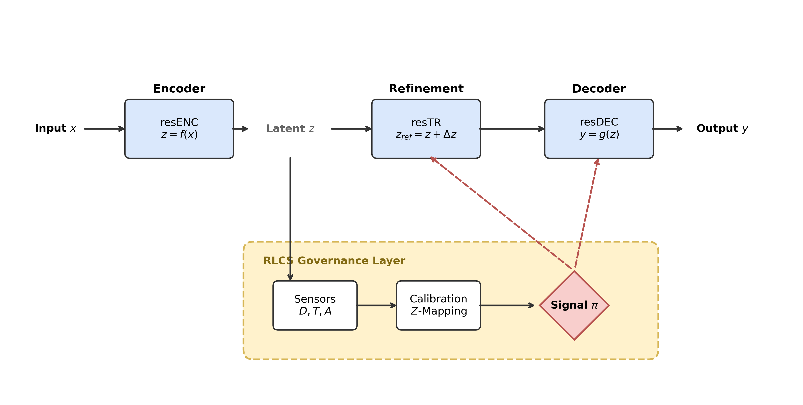

# resED: Representation gated Encoder-Decoder

**resED** is a modular generative system derived from the **Representation-Level Control Surfaces (RLCS)** paradigm. It treats reliability as a managed system property rather than a learned model attribute.

## System Architecture



The system consists of four governed layers:
1.  **resENC (Encoder)**: Deterministic feature extraction with a statistical side-channel.
2.  **RLCS (Governance)**: A statistical control surface that evaluates latent representations against a reference manifold.
3.  **resTR (Transformer)**: A strictly residual refinement module gated by governance signals.
4.  **resDEC (Decoder)**: A controlled decoder that implements a "fail-safe" mechanism (ABSTAIN/DEFER).

## Core Thesis
**"Reliability is a system property, not a component property."** 
Individual deep learning modules are opaque and volatile. resED provides observability and governance to ensure that generative models only execute within validated statistical bounds.

## Key Features
*   **Domain Agnostic**: Validated across Vision (CIFAR-10) and Biology (Bioteque Gene Embeddings).
*   **Structural Calibration**: Normalizes risk scores using Z-mapping to handle dimensionality scaling.
*   **Deterministic Control**: Purely functional control logic without learned safety discriminators.

## Documentation
*   **[Full Scientific Manuscript](manuscript/main.pdf)**: Comprehensive report with formal methodology and empirical validation.
*   **[Methodology](manuscript/sections/methodology.tex)**: Mathematical definitions.
*   **[Failure Modes](docs/failure_modes.md)**: Taxonomy of detectable anomalies.

## Usage
```python
from resed.system.resed_block import ResEdBlock

# Initialize governed system
block = ResEdBlock(d_in=128, d_z=64, d_out=10)

# Governed Inference
outputs, diagnostics = block.forward(input_data)
```

## Explicit Non-Claims
*   resED does **not** fix model errors; it suppresses them.
*   The system is semantically blind; it monitors statistical typicality.
*   Reliability depends on the representativeness of the reference population.
